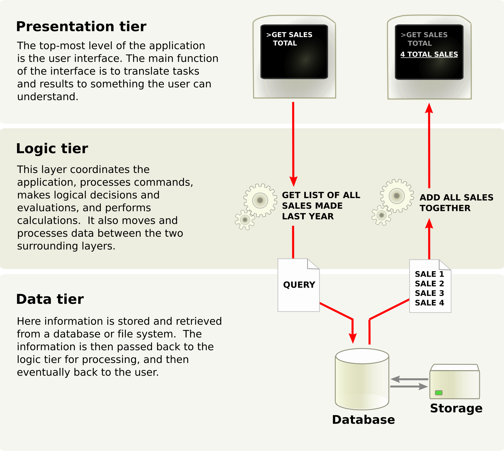

# Demo CRM 脚手架

这是一个基于 Spring Boot 的简单项目脚手架，包含常用的功能和最佳实践，帮助开发者快速启动并构建基于 Spring 的应用。

## 目录

- [功能特性](#功能特性)
- [技术栈](#技术栈)
- [快速开始](#快速开始)
- [项目结构](#项目结构)
- [API 文档](#api-文档)
- [配置说明](#配置说明)
- [测试](#测试)
- [贡献指南](#贡献指南)
- [许可证](#许可证)

## 功能特性

- 用户登录和登出
- 基于 Shiro 的认证与授权
- 常用的 CRUD 接口示例
- 全局异常处理
- 封装通用数据访问层（DAL）
- 统一的响应格式
- 基本的数据库配置（支持 MariaDB）
- 常用的工具类封装


## 技术栈

-   后端: [Spring Boot](https://www.tutorialspoint.com/spring_boot/spring_boot_introduction.htm)
-   前端: [Vue.js](https://vuejs.org/)
-   中间件: [MariaDB](https://mariadb.com/),  [MinIO（可选）](https://min.io/), [Redis](https://redis.com/)
-   基础设施: [Docker](https://www.docker.com/)

## 架构概述

遵循[多层架构](https://en.wikipedia.org/wiki/Multitier_architecture)，这意味着表示、业务逻辑和数据存储是分开的。更具体地说，它使用三层架构（图片来自维基百科）：



三层架构

表示层是 VUE.js、HTML5、JavaScript 和 CSS 的组合。逻辑层完全用 Java 编写，而数据层仅支持 MariaDB 作为 RDBMS。


## 快速开始

### 环境准备

1. 确保已安装 Java 21 或更高版本。
2. 确保已安装 Maven 3.6 或更高版本。
3. 确保已配置好 MariaDB 数据库（或其他支持的数据库）。

### 克隆项目

```bash
git clone https://github.com/fit2-zhao/demo-crm.git
cd demo-crm
```

### 配置数据库

修改 `/opt/demo/conf/demo.properties` 文件，设置数据库连接信息：

``` Properties
spring.datasource.url=jdbc:mariadb://ip:3306/database?autoReconnect=false&useUnicode=true&characterEncoding=UTF-8&characterSetResults=UTF-8&zeroDateTimeBehavior=convertToNull&useSSL=false
spring.datasource.password=pwd
spring.datasource.username=username

```

### 运行项目

在项目根目录运行以下命令启动项目：

```bash
# 此命令会将parent pom 安装到本地仓库，其他外部子工程可以获得最新的 <properties></properties>
./mvnw install -N

# 此命令会将 domain sdk ，其他外部子工程可以获得最新的 jar
./mvnw clean install -DskipTests -DskipAntRunForJenkins --file backend/pom.xml

```
### 整体打包

```bash
./mvnw clean package

```

项目启动后访问 `http://localhost:8081` 进行测试。

## 项目结构

```plaintext
├── backend                       # 后端代码
│   ├── framework                  # 框架层
│   │   ├── src                    # 源代码
│   │   │   └── main               # 主代码
│   │   │       ├── java           # Java代码
│   │   │       │   └── io         # IO层
│   │   │       │       └── demo   # 示例代码
│   │   │       │           ├── aspectj  # AOP相关
│   │   │       │           │   ├── annotation    # 注解
│   │   │       │           │   ├── aspect        # 切面
│   │   │       │           │   ├── builder       # 构建器
│   │   │       │           │   ├── constants     # 常量
│   │   │       │           │   ├── dto           # 数据传输对象
│   │   │       │           │   └── event         # 事件
│   │   │       │           ├── common  # 公共功能
│   │   │       │           │   ├── constants     # 常量
│   │   │       │           │   ├── exception     # 异常
│   │   │       │           │   ├── groups        # 分组
│   │   │       │           │   ├── pager         # 分页
│   │   │       │           │   │   └── condition  # 条件分页
│   │   │       │           │   ├── response      # 响应处理
│   │   │       │           │   │   ├── handler    # 响应处理器
│   │   │       │           │   │   └── result     # 结果
│   │   │       │           │   ├── uid           # 唯一标识符
│   │   │       │           │   │   ├── buffer    # 缓冲区
│   │   │       │           │   │   ├── impl      # 实现
│   │   │       │           │   │   ├── utils     # 工具
│   │   │       │           │   │   └── worker    # 工作单元
│   │   │       │           │   └── util          # 工具类
│   │   │       │           │       └── rsa       # RSA加密
│   │   │       │           ├── config      # 配置
│   │   │       │           ├── file        # 文件
│   │   │       │           │   └── engine   # 引擎
│   │   │       │           ├── mybatis     # MyBatis配置
│   │   │       │           │   ├── interceptor  # 拦截器
│   │   │       │           │   └── lambda       # Lambda
│   │   │       │           └── security    # 安全性
│   └── module-crm                # CRM模块
│       ├── src                    # 源代码
│       │   ├── main               # 主代码
│       │   │   ├── java           # Java代码
│       │   │   │   └── io         # IO层
│       │   │   │       └── demo   # 示例代码
│       │   │   │           ├── common  # 公共功能
│       │   │   │           │   ├── constants  # 常量
│       │   │   │           │   ├── interceptor  # 拦截器
│       │   │   │           │   ├── request     # 请求
│       │   │   │           │   ├── schedule    # 调度
│       │   │   │           │   └── security    # 安全性
│       │   │   │           │       └── realm   # 领域
│       │   │   │           ├── config      # 配置
│       │   │   │           ├── listener    # 监听器
│       │   │   │           └── modules     # 模块
│       │   │   │               ├── customer    # 客户模块
│       │   │   │               ├── marketing   # 市场模块
│       │   │   │               ├── order       # 订单模块
│       │   │   │               ├── reporting   # 报告模块
│       │   │   │               ├── sales       # 销售模块
│       │   │   │               └── system      # 系统模块
│       │   │   │                   ├── controller   # 控制器
│       │   │   │                   ├── domain       # 领域模型
│       │   │   │                   ├── mapper       # 映射器
│       │   │   │                   └── service      # 服务
│       │   │   └── resources       # 资源
│       │   │       ├── i18n        # 国际化
│       │   │       ├── migration   # 数据库迁移
│       │   │       │   └── 1.0.0   # 迁移版本
│       │   │       └── static      # 静态文件
│       │   │           ├── css     # CSS样式
│       │   │           └── js      # JS脚本
│       │   └── test                # 测试代码
│       │       ├── java           # 测试代码
│       │       │   └── io         # IO层
│       │       │       └── demo   # 示例代码
└── frontend                      # 前端代码
    ├── dist                      # 发布版本
    │   ├── css                   # CSS文件
    │   └── js                    # JavaScript文件
    ├── public                    # 公共静态资源
    └── src                       # 源代码
        ├── assets                 # 静态资源
        └── components             # 组件

```

## API 文档

以下是一些示例 API 端点。详细的 API 文档可以使用 Swagger 自动生成，或使用 Postman 等工具导出。

### 示例接口

- **POST /login** - 用户登录
- **GET /signout** - 退出登录

> **提示**：如需测试，请确保在请求头中添加 `Authorization: Bearer <token>`。

## 配置说明

`demo.properties` 是主要的配置文件，包含数据库配置。


## 测试

### 单元测试

项目包含了基本的单元测试，主要测试服务层和控制器层的业务逻辑。你可以使用以下命令运行测试：

```bash
mvn test
```

### 集成测试

集成测试确保应用的不同模块可以正常协作，推荐在 CI/CD 环境中运行。

## 贡献指南

如果你想为该项目贡献代码，请遵循以下步骤：

1. Fork 该项目。
2. 创建你的特性分支 (`git checkout -b feature/AmazingFeature`)。
3. 提交你的修改 (`git commit -m 'Add some AmazingFeature'`)。
4. Push 到分支 (`git push origin feature/AmazingFeature`)。
5. 提交一个 Pull Request。

请确保你的代码符合项目的代码风格，并通过所有的测试。

## 许可证

该项目遵循 [MIT 许可证](LICENSE) 许可，你可以自由地使用和修改。
